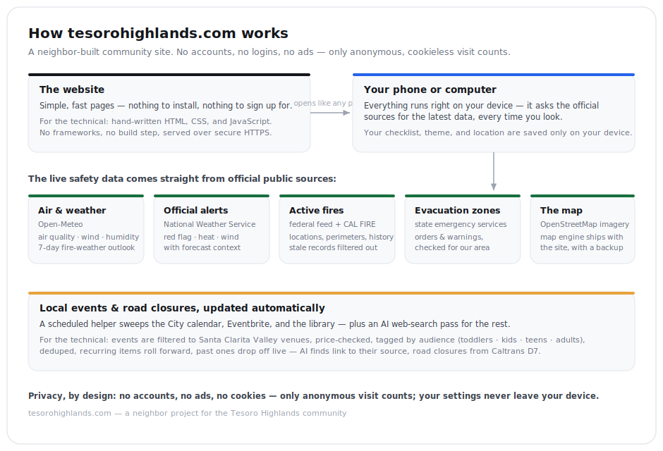

# Tesoro Highlands — Community Hub

A neighbor-built hub for the **Tesoro Highlands community, Valencia CA 91354**. Lives at **tesorohighlands.com**.

The hub answers the questions a household in a fire-zone community actually asks — **Can the kids play outside? What are we breathing? Do we need to get ready to leave?** — and grows from there into everyday community info: local events, amenities, and HOA transparency.

## How it's built



(The live copy of this diagram is at [tesorohighlands.com/stack.svg](https://tesorohighlands.com/stack.svg).)

## Pages

```
/            landing hub — live "right now" safety status + section cards
/fire        the full fire & emergency dashboard (live map, air, weather, evac, checklist)
/events      community events + auto-updated local Santa Clarita feed
/living      everyday local info (coming soon)
/hoa         HOA transparency (coming soon; unofficial, resident-run)
```

## Project layout

```
index.html / fire.html / events.html / living.html / hoa.html
th.css                shared design tokens (light/dark/manual) + shell styles
theme.js              theme boot — auto/light/dark, persisted, no flash (loads first in <head>)
nav.js                injected top nav + theme toggle + live status strip (5-min session cache)
icon.svg              favicon
events.json           auto-built local feed (see pipeline below) — do not edit by hand
community-events.json neighbor events, maintained via git (schema below)
vendor/leaflet/       self-hosted Leaflet 1.9.4 (no CDN dependency during an emergency)
scripts/fetch-events.mjs   feed builder (Node, no deps)
.github/workflows/refresh-events.yml   ~30-min cron that refreshes events.json
server.js             tiny static server for LOCAL dev only (clean URLs like Vercel)
vercel.json           static deploy config (headers, clean URLs)
sitemap.xml / robots.txt
```

## Run it locally

```
node server.js       # serves on http://localhost:3100 with /fire-style clean URLs
```

## What's live vs. curated

| Panel | Source | Status |
|---|---|---|
| Air quality (US AQI, PM2.5/PM10, hourly outlook) | Open-Meteo Air Quality API | **Live**, no key |
| Fire weather (wind, gusts, humidity, temp) | Open-Meteo Forecast API | **Live**, no key |
| Active alerts (Red Flag, Fire Weather, Heat) | NWS `api.weather.gov` | **Live**, no key |
| Nearby fires — list, map points & perimeters | NIFC/WFIGS ArcGIS (`WFIGS_Incident_Locations_Current`, `WFIGS_Interagency_Perimeters_Current`) | **Live**, no key |
| Evacuation zone status (Order / Warning) | Cal OES "California Active Evacuation Zones" ArcGIS | **Live**, no key |
| Local attendable events (audience-tagged, priced) | City of Santa Clarita calendar (Localist JSON) + Eventbrite (4 SCV searches) + SC Public Library calendar | **Auto** via script |
| Community events | `community-events.json` in git | Curated |

The dashboard's status logic is deliberately conservative (small routine incidents don't turn the page red), and every live panel degrades honestly — a failed feed says "unavailable," never "all clear."

## The local events pipeline

`scripts/fetch-events.mjs` pulls from three sources: (1) the **City of Santa Clarita** official calendar at `calendar.santaclarita.gov` (a Localist install) via its public `/api/2/events` JSON — city events, cultural nights, brewery/restaurant happenings, Concerts in the Park, each with a `free` flag; (2) **Eventbrite**'s public search pages for four SCV city slugs (embedded `__SERVER_DATA__` JSON), keeping only Santa Clarita Valley venues, dropping corporate training-mill spam, and fetching each event page for the real price (`isFree` / `lowPrice`–`highPrice`); (3) the **Santa Clarita Public Library** calendar (`santaclarita.librarycalendar.com`) via its server-rendered per-day feed — free programs across all branches, using the library's own age-group taxonomy (Babies/Toddler/Preschool/Storytime/Teens/Adults). Everything is tagged by audience (toddlers / kids / teens / adults) for the filter chips, recurring programs carry all their dates so they roll forward, results are deduped, and `events.json` is written only when content changed. Each source fails soft and carries its previous events forward. No backend, no keys.

Sources checked and rejected for automation: Visit Santa Clarita (no feed/API/JSON-LD — HTML only), KHTS events (no calendar API), SCVNews and santa-clarita.com (bot-blocked), santaclaritaarts.com / The MAIN (events page 404s, no working API — its shows appear on Eventbrite anyway), College of the Canyons / canyonspac (no public calendar API found), Patch / SCVTV / Senior Center (no feed), SCV Chamber (unreachable), AllEvents.in and Meetup (JSON-LD present but third-party aggregators / JS-heavy and ToS-gray — the City's Localist covers the same official ground). Old Town Newhall also runs on Localist, but its events already flow through the City calendar.

Fragility notes: this parses Eventbrite's page structure, which can change; the script fails soft (keeps the last good file) and the page shows a "feed may be stale" note past 5 days. As of 2026-07-07 Eventbrite 405-blocks GitHub-hosted runner IPs, so the Action is a light self-healing retry (every 4h) rather than the primary refresh — real refreshes are `node scripts/fetch-events.mjs` from a residential IP, then push (or a scheduled task on a home machine).

### community-events.json schema

```json
[{ "title": "Ice-cream social", "date": "2026-07-12", "time": "4:00 PM", "place": "The park", "note": "BYO toppings", "url": "" }]
```

Past-dated entries drop off automatically; keeping history in the file is fine.

## Theming

Light/dark follows the visitor's system by default; the nav toggle (◐/☀/☾) forces light or dark, persisted per device in localStorage. Tokens live once in `th.css`; the map swaps to dark basemap tiles automatically.

## Neighbor knowledge

Some fire-safety content is adapted from guidance neighbors shared in the community group chat, credited in-app as local knowledge (not official) and kept anonymous.

## Not an official source

This is a community tool, not an emergency-warning system, and not the HOA. Always follow CAL FIRE, LA County Fire, and Sheriff evacuation orders. In an emergency call 911.
