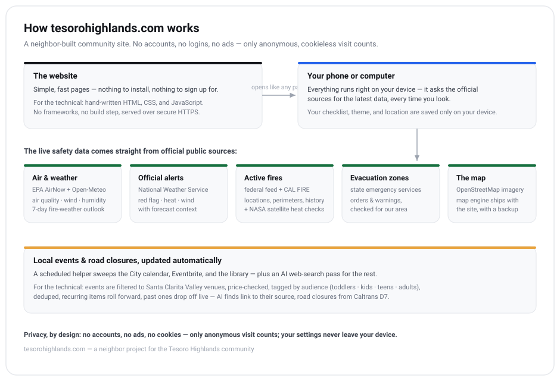

# Tesoro Highlands — Community Hub

A neighbor-built hub for **Tesoro Highlands, Valencia CA 91354**, living at
**[tesorohighlands.com](https://tesorohighlands.com)**.

It answers the questions a household in wildfire country actually asks — *what's
burning near us, what are we breathing, do we need to get ready to leave* — and grows
from there into the everyday stuff: local events, practical living info, and plain
English about your rights as a California homeowner.

**Not official.** This isn't the HOA and isn't an emergency-warning system. Always
follow CAL FIRE, LA County Fire, and Sheriff evacuation orders, and call 911 in an
emergency.

*Last reviewed: 2026-08-26. If you change a workflow cadence, a data source, or a cost
figure, please update this file in the same commit.*

## Want to help?

See **[CONTRIBUTING.md](CONTRIBUTING.md)**. Short version: fork it, open a pull
request, no special access needed. There are rules in there that aren't obvious —
worth a skim before touching the fire logic.

## Fork it for your own neighborhood

That's an explicit goal. It's plain HTML, CSS and JavaScript with no build step, so
you can read the whole thing. The pieces you'd change are the coordinates in
`fire.html` / `nav.js`, the local phone numbers in `living.html`, and the event
sources in `scripts/fetch-events.mjs`. Apache-2.0 licensed, so go ahead — just note
the license asks you to mark files you've changed, and please don't imply your fork
is this site.

## How it's built



*(Live copy: [tesorohighlands.com/stack.svg](https://tesorohighlands.com/stack.svg))*

Plain HTML/CSS/JS. No framework, no build step, no bundler. **Three** Vercel serverless
route handlers under `api/` (`calfire`, `purpleair`, `tempest-forecast`), plus shared
`api/_epa.js` (not a route). Data refreshes come from scheduled GitHub Actions
that commit JSON back to the repo, which redeploys the site. Everything a visitor's
browser fetches is either a static file, a proxied government API, or one of those
functions (some need repo secrets on Vercel).

## Pages

```
/            hub — live "right now" status, alert chips, what's coming up,
             live one-liners per section, "new on this site" changelog
/fire        the dashboard — nearby fires (CAL FIRE acreage/containment + NASA VIIRS
             satellite heat), measured air quality, fire weather, NWS alerts, 7-day
             outlook, Leaflet fire/evac map, evacuation status + routes + go-bag
             checklist, road closures, power outages, earthquakes
/weather     backyard weather — Tempest + PurpleAir now readings, EPA-corrected AQI
             with 24h sparkline, hourly and 10-day Better Forecast (labeled model,
             not measured); links back to Fire for emergency context
/events      community events + auto-built local feed + AI-found extras (merged into
             one list) + the Friday AI weekend roundup with Copy-for-WhatsApp
/living      utilities, trash, schools, health, fire-zone insurance, amenities,
             neighbor-recommended local pros
/hoa         CA homeowner rights, your documents, the dispute ladder
             (deliberately no board schedules or internal community matters)
```

## Project layout

```
index.html weather.html fire.html events.html living.html hoa.html 404.html
th.css                the only stylesheet — design tokens (light/dark) + shell
theme.js              theme boot, runs before first paint so there's no flash
nav.js                injected nav, theme toggle, site-wide live status strip
                      (loaded as /nav.js?v=N — bump N when you change it)
api/calfire.js        proxies incidents.fire.ca.gov (no CORS upstream), CDN ~2 min
api/purpleair.js      backyard PurpleAir snapshot — C0 10-min + EPA-corrected 60-min (/weather)
api/tempest-forecast.js  WeatherFlow Better Forecast hourly + 10-day (/weather)
api/_epa.js           shared EPA ATM correction math (used by purpleair.js)
server.js             tiny static server for LOCAL dev only (mimics clean URLs)
vendor/leaflet/       self-hosted Leaflet 1.9.4 — no CDN dependency in an emergency
scripts/*.mjs         the data builders (see below)
community-events.json neighbor events, hand-maintained (schema below)
events.json ai-events.json roads.json alert.json roundup.json purpleair-history.json
                      bot-written — never hand-edit, they get overwritten
updates.json          the "new on this site" changelog, hand-maintained
```

## Scheduled jobs

| Workflow | Cadence | What it does | Costs money? |
|---|---|---|---|
| `refresh-events.yml` | every 4h | Rebuilds `events.json` + `roads.json` | No |
| `alert-watch.yml` | every 10 min | Checks evac/fire/red-flag/quake/PSPS for our area, writes `alert.json` (the one-tap WhatsApp share card), optional phone ping via ntfy | No |
| `refresh-purpleair-history.yml` | hourly (:12) | Fetches 24h PurpleAir history → `purpleair-history.json` (sparkline on `/weather`) | No (needs `PURPLEAIR_API_KEY` secret) |
| `refresh-ai-events.yml` | daily ~6:23am PT | Claude web-search sweep for events the feeds miss → `ai-events.json` | Yes |
| `weekend-roundup.yml` | Fridays ~8:23am PT | Claude curates 5–7 weekend picks → `roundup.json` | Yes |

**Running cost:** roughly **$5–8/month** total on `claude-haiku-4-5` — the daily events
sweep (~$0.15–0.20/run with web search capped at 12 uses) plus the Friday roundup
(a few cents). Both need the `ANTHROPIC_API_KEY` repo secret; without it they exit
cleanly and commit nothing. The PurpleAir history job needs `PURPLEAIR_API_KEY` on
GitHub Actions and the same key plus `TEMPEST_TOKEN` / `TEMPEST_STATION_ID` on Vercel
for the live weather APIs. Everything else on the site is free and keyless.

## What's live vs. curated

| Panel | Source | Status |
|---|---|---|
| Air quality on Fire / Home / nav strip | EPA **AirNow** monitor within ~15 mi (Open-Meteo `us_aqi` model as fallback) | **Live**, no key |
| Air quality on `/weather` | **Backyard PurpleAir** EPA-corrected 60-min ATM (`primary.aqiEpa` via `/api/purpleair`); 24h sparkline from `purpleair-history.json` | **Live** (sensor needs `PURPLEAIR_API_KEY` on Vercel) + **Auto** history |
| Backyard weather now (`/weather`) | Neighbor **Tempest** via WeatherFlow (`/api/tempest-forecast` current block) | **Live** (needs `TEMPEST_TOKEN` + `TEMPEST_STATION_ID`) |
| Hourly + 10-day forecast (`/weather`) | WeatherFlow **Better Forecast** model for that station — labeled forecast, not measured | **Live** (same Tempest keys) |
| Fire weather (wind, gusts, humidity, temp) on `/fire` | Open-Meteo Forecast API | **Live**, no key |
| Active alerts (Red Flag, heat, wind, smoke) | NWS `api.weather.gov` | **Live**, no key |
| Nearby fires — list, map points, perimeters | NIFC/WFIGS ArcGIS | **Live**, no key |
| Fire acreage + containment | CAL FIRE via `api/calfire` proxy | **Live**, no key |
| Satellite heat detection | NASA VIIRS (Esri Living Atlas mirror) | **Live**, no key |
| Evacuation status (Order / Warning / Shelter) | Cal OES statewide evacuation zones | **Live**, no key |
| Power outages incl. PSPS | Cal OES statewide utility feed | **Live**, no key |
| Earthquakes | USGS | **Live**, no key |
| Road closures | Caltrans D7 Lane Closure System → `roads.json` | **Auto** |
| Local events | City of Santa Clarita (Localist) + Eventbrite + SC Public Library → `events.json` | **Auto** |
| Extra events from the wider web | Claude web search → `ai-events.json`, merged into the main list | **Auto** (needs key) |
| Weekend picks | Claude, choosing by index from our own verified feed → `roundup.json` | **Auto** (needs key) |
| Fire history (439 fires on record) | NIFC Interagency Fire Perimeter History | Baked snapshot (Jul 2026) |
| Community events | `community-events.json` | Curated |

Every live panel degrades honestly: **a failed feed says "unavailable," never "all
clear."** The status logic is deliberately conservative, and alert thresholds are
tuned so a distant fire informs without alarming.

**Two AQI bases are intentional.** `/weather` shows EPA-corrected 60-minute ATM from
`/api/purpleair` for the headline and sparkline. Fire, Home “Air today,” and the nav
strip (except on `/weather`) still use their existing AirNow/Open-Meteo path until
separately wired to PurpleAir. They will disagree sometimes — see `CONTRIBUTING.md`.

## The local events pipeline

`scripts/fetch-events.mjs` pulls three sources: the **City of Santa Clarita** calendar
(a Localist install, public `/api/2/events` JSON); **Eventbrite** public search pages
for four SCV city slugs (embedded `__SERVER_DATA__`, filtered to SCV venues, spam
dropped, each event page fetched for real pricing); and the **Santa Clarita Public
Library** per-day feed (using the library's own age taxonomy). Everything is tagged by
audience, recurring programs carry all their dates so they roll forward, results are
deduped, and the file is written only when content actually changed. Each source fails
soft and carries its previous events forward.

**Sources checked and rejected** (so nobody re-litigates them): Visit Santa Clarita
(no feed), KHTS (no API), SCVNews and santa-clarita.com (bot-blocked), The MAIN (404s;
shows appear on Eventbrite anyway), College of the Canyons (no public API), Patch /
SCVTV / Senior Center (no feed), SCV Chamber (unreachable), AllEvents.in and Meetup
(aggregators, ToS-gray), LA County Library (JS-only Communico app), Canyon Theatre
Guild (no event schema).

**Fragility note:** the Eventbrite step parses page structure, which can change, and
Eventbrite 405-blocks GitHub runner IPs intermittently. The script fails soft and the
page shows "feed may be stale" past 5 days.

### AI-assisted discovery

`scripts/fetch-ai-events.mjs` uses Claude's web search for events no feed carries —
venue pages, farms, breweries, churches. Results come back through a strict-schema
tool, get validated hard (real URL, in-window date, SCV city), and land in a separate
`ai-events.json` that the events page merges into the main list.

`scripts/weekend-roundup.mjs` is hallucination-proof by construction: Claude picks
events **by index** from our own verified feed and writes only a short note. Every
title, day, time and price is formatted from our data, so the model cannot invent an
event that doesn't exist.

### community-events.json schema

```json
[{ "title": "Ice-cream social", "date": "2026-07-12", "time": "4:00 PM",
   "place": "The park", "note": "BYO toppings", "url": "" }]
```

Past-dated entries drop off automatically; keeping history in the file is fine.

## Theming

Light/dark follows the system by default; the nav toggle (◐/☀/☾) forces one, persisted
per device. Tokens live once in `th.css`, and the map swaps basemap tiles to match.

## Neighbor knowledge

Some fire-safety content is adapted from guidance neighbors shared in the community
group chat, credited in-app as local knowledge (not official) and kept anonymous.

## License

Apache-2.0 — see [LICENSE](LICENSE).

This covers the site's own code and writing. It does **not** cover: the data files
built from third-party feeds (`events.json`, `ai-events.json`, `roads.json`,
`alert.json`), whose listings belong to their organizers and agencies; or
`vendor/leaflet/`, which is Leaflet under BSD-2-Clause.

Note that a code license protects against "I forked your code and it broke." It has
nothing to do with someone reading the website — that's what the on-page disclaimers
are for.
